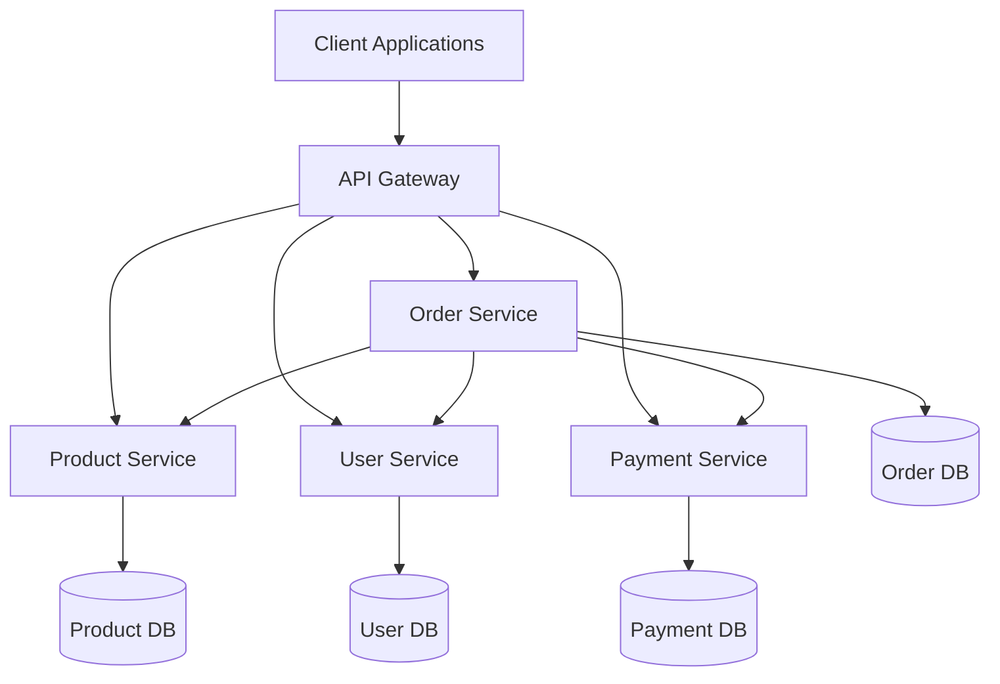

# EAI Microservices Project

This project demonstrates an Enterprise Application Integration (EAI) system built with microservices architecture.

## Architecture Overview



## Services

1. **Order Service**
   - Manages order processing and tracking
   - Depends on: Product, User, and Payment services
   - Database: PostgreSQL

2. **Product Service**
   - Manages product catalog and inventory
   - Independent service
   - Database: MongoDB

3. **User Service**
   - Handles user management and authentication
   - Independent service
   - Database: PostgreSQL

4. **Payment Service**
   - Processes payments and transactions
   - Independent service
   - Database: PostgreSQL

## Technology Stack

- **Containerization**: Docker
- **API Layer**: GraphQL (Apollo Server)
- **Databases**: 
  - PostgreSQL (Order, User, Payment services)
  - MongoDB (Product service)
- **Service Communication**: GraphQL Federation

## Project Structure

```
eai-microservices/
├── docker-compose.yml
├── README.md
├── services/
│   ├── order-service/
│   │   ├── Dockerfile
│   │   ├── package.json
│   │   ├── src/
│   │   │   ├── index.js
│   │   │   ├── schema/
│   │   │   │   ├── typeDefs.graphql
│   │   │   │   └── resolvers.js
│   │   │   ├── models/
│   │   │   │   └── order.js
│   │   │   └── services/
│   │   │       └── orderService.js
│   │   └── README.md
│   ├── product-service/
│   │   ├── Dockerfile
│   │   ├── package.json
│   │   ├── src/
│   │   │   ├── index.js
│   │   │   ├── schema/
│   │   │   │   ├── typeDefs.graphql
│   │   │   │   └── resolvers.js
│   │   │   ├── models/
│   │   │   │   └── product.js
│   │   │   └── services/
│   │   │       └── productService.js
│   │   └── README.md
│   ├── user-service/
│   │   └── ...
│   └── payment-service/
│       └── ...
└── gateway/
    ├── Dockerfile
    ├── package.json
    └── src/
        └── index.js
```

## Setup Instructions

1. Clone the repository:
   ```bash
   git clone https://github.com/yourusername/eai-microservices.git
   cd eai-microservices
   ```

2. Install dependencies for each service:
   ```bash
   cd services/order-service && npm install
   cd ../product-service && npm install
   cd ../user-service && npm install
   cd ../payment-service && npm install
   cd ../../gateway && npm install
   ```

3. Start the services using Docker Compose:
   ```bash
   docker-compose up -d
   ```

4. Access the GraphQL playground:
   - Main Gateway: http://localhost:4000/graphql
   - Order Service: http://localhost:4001/graphql
   - Product Service: http://localhost:4002/graphql
   - User Service: http://localhost:4003/graphql
   - Payment Service: http://localhost:4004/graphql

## Service Communication Example

### Order Service Querying Product Service

```graphql
# Order Service Schema
type Order {
  id: ID!
  userId: ID!
  products: [Product!]!
  total: Float!
  status: OrderStatus!
}

# Product Service Schema
type Product {
  id: ID!
  name: String!
  price: Float!
  stock: Int!
}

# Example Query
query {
  order(id: "123") {
    id
    products {
      id
      name
      price
    }
    total
    status
  }
}
```

## API Documentation

Detailed API documentation for each service can be found in their respective README files:

- [Order Service API Documentation](services/order-service/README.md)
- [Product Service API Documentation](services/product-service/README.md)
- [User Service API Documentation](services/user-service/README.md)
- [Payment Service API Documentation](services/payment-service/README.md)

## Contributing

1. Fork the repository
2. Create your feature branch (`git checkout -b feature/amazing-feature`)
3. Commit your changes (`git commit -m 'Add some amazing feature'`)
4. Push to the branch (`git push origin feature/amazing-feature`)
5. Open a Pull Request

## License

This project is licensed under the MIT License - see the [LICENSE](LICENSE) file for details. 